# CRIS — Architectural Design Diagram

This diagram is the source-controlled view of the architecture currently defined by the
repository. It describes what the code can provision; it does not assert that a shared AWS
environment is deployed. The [architecture overview](architecture.md) remains the detailed
source for implementation status, guarantees, and deferred work.

```mermaid
flowchart LR
  subgraph people["People"]
    citizen["Citizen / field reporter"]
    public["Public map visitor"]
    operations["Volunteer / responder / coordinator / admin"]
  end

  subgraph clients["Client applications"]
    mobile["Expo + React Native mobile app<br/>reporting, GPS / map pin, offline retry"]
    publicWeb["React web public surfaces<br/>report form + incident map"]
    workspace["React web operational workspace<br/>queue, map, detail rail, task board"]
    mapTiles["Configurable MapLibre<br/>style / tile provider"]
  end

  subgraph aws["AWS serverless application — Amplify Gen 2 + CDK"]
    direction LR

    subgraph edge["Identity and API boundary"]
      cognito["Amazon Cognito<br/>User Pool groups + guest Identity Pool"]
      appsync["AWS AppSync GraphQL API<br/>Cognito / IAM authorization"]
    end

    subgraph synchronous["Synchronous application paths"]
      writeResolvers["Lambda mutation resolvers<br/>submitReport · updateReportStatus · assignTeam"]
      readResolvers["Lambda projection resolvers<br/>listPublicReports · listVolunteerTasks"]
      mediaResolver["Lambda media resolver<br/>createMediaUploadUrl"]
      publisher["Lambda publish resolver<br/>publishReportUpdate"]
    end

    subgraph data["Durable data"]
      dynamodb[("Amazon DynamoDB<br/>11 models · Report GSIs · audit events")]
      s3[("Amazon S3<br/>report media")]
      dataKey["AWS KMS customer-managed key<br/>triage queues + operations topic"]
    end

    subgraph triage["Asynchronous triage pipeline"]
      triagePipe["EventBridge Pipe<br/>NEW report filter"]
      triageQueue["Amazon SQS classification queue<br/>queue DLQ + separate pipe DLQ"]
      classifier["classify-report Lambda<br/>classify · geocode · deterministic score · dedupe"]
      bedrock["Amazon Bedrock<br/>Claude triage agent"]
      places["Amazon Location Places<br/>geocoding"]
    end

    subgraph alerts["Durable proximity-alert pipeline"]
      alertPipe["EventBridge Pipe<br/>new P0 / P1 AI_CLASSIFIED threshold"]
      alertQueue["Amazon SQS alert queue<br/>queue DLQ + separate pipe DLQ"]
      alertDispatch["alert-dispatch Lambda<br/>match subscriptions · lease deliveries"]
      sns["Amazon SNS<br/>SMS"]
      ses["Amazon SES<br/>email"]
    end

    subgraph operationsServices["Operations and delivery"]
      telemetry["AWS X-Ray + CloudWatch<br/>traces, metrics, alarms, SLA dashboard"]
      opsTopic["Encrypted operations SNS topic"]
      hosting["AWS Amplify Hosting<br/>web SPA"]
    end
  end

  subgraph delivery["Source delivery"]
    github["GitHub Actions<br/>CI → gated CD → smoke transaction"]
    amplify["Amplify pipeline deploy<br/>backend + hosting"]
  end

  citizen --> mobile
  citizen --> publicWeb
  public --> publicWeb
  operations --> workspace

  publicWeb --> mapTiles
  workspace --> mapTiles
  mobile --> mapTiles
  hosting --> publicWeb
  hosting --> workspace

  mobile -. "optional sign-in / guest credentials" .-> cognito
  publicWeb -. "optional sign-in / guest credentials" .-> cognito
  workspace -->|"sign-in + role groups"| cognito
  cognito -->|"JWT or temporary AWS credentials"| appsync

  mobile -->|"submit + request upload URL"| appsync
  publicWeb -->|"submit + polled public snapshot"| appsync
  workspace -->|"staff reads + guarded actions"| appsync

  appsync --> writeResolvers
  appsync --> readResolvers
  appsync --> mediaResolver
  appsync -->|"generated staff model reads"| dynamodb
  writeResolvers -->|"version-checked transactions"| dynamodb
  readResolvers -->|"server-enforced projections"| dynamodb
  mediaResolver -->|"short-lived presigned POST"| s3
  mobile -->|"policy-constrained upload"| s3
  publicWeb -->|"policy-constrained upload"| s3

  dynamodb -->|"Report stream"| triagePipe
  triagePipe -->|"IDs + trace metadata only"| triageQueue
  triageQueue --> classifier
  classifier -->|"read report; conditional write + audit"| dynamodb
  classifier --> bedrock
  classifier --> places

  dynamodb -->|"Report stream"| alertPipe
  alertPipe -->|"report ID + priority band only"| alertQueue
  alertQueue --> alertDispatch
  alertDispatch -->|"read report, subscriptions, deliveries"| dynamodb
  alertDispatch -->|"resolve recipient contact"| cognito
  alertDispatch --> sns
  alertDispatch --> ses

  classifier -->|"IAM call after durable commit"| appsync
  writeResolvers -->|"transition / assignment publish after commit"| appsync
  appsync --> publisher
  publisher -->|"redacted PublicReport event"| appsync
  appsync -->|"authenticated subscriptions<br/>invalidation / reconciliation"| workspace

  dataKey -. "encrypts" .-> triageQueue
  dataKey -. "encrypts" .-> alertQueue
  dataKey -. "encrypts" .-> opsTopic
  appsync -. "telemetry" .-> telemetry
  writeResolvers -. "telemetry" .-> telemetry
  classifier -. "telemetry" .-> telemetry
  alertDispatch -. "telemetry" .-> telemetry
  telemetry -->|"alarm notifications"| opsTopic

  github --> amplify
  amplify --> hosting
  amplify -->|"provision / update"| aws

  classDef person fill:#0f2742,stroke:#38bdf8,color:#ffffff,stroke-width:1.5px;
  classDef client fill:#e0f2fe,stroke:#0284c7,color:#0f172a;
  classDef service fill:#eef2ff,stroke:#4f46e5,color:#0f172a;
  classDef store fill:#ecfdf5,stroke:#059669,color:#0f172a,stroke-width:2px;
  classDef external fill:#fff7ed,stroke:#ea580c,color:#0f172a;
  classDef deliveryNode fill:#f8fafc,stroke:#64748b,color:#0f172a;

  class citizen,public,operations person;
  class mobile,publicWeb,workspace client;
  class cognito,appsync,writeResolvers,readResolvers,mediaResolver,publisher,triagePipe,triageQueue,classifier,alertPipe,alertQueue,alertDispatch,telemetry,opsTopic,hosting service;
  class dynamodb,s3,dataKey store;
  class mapTiles,bedrock,places,sns,ses external;
  class github,amplify deliveryNode;
```

## Reading the diagram

- Solid arrows are runtime or delivery paths. Dotted arrows are credentials, encryption, or
  telemetry relationships.
- The acknowledged write happens at DynamoDB before AI triage or real-time publication. A
  downstream dependency failure therefore does not erase an accepted report.
- Public map reads use a server-redacted, status-filtered snapshot. Real-time subscriptions are
  authenticated and carry only the `PublicReport` projection.
- Classification and alert queues have consumer DLQs; each stream-to-queue pipe also has a
  separate DLQ because pipe failures contain a different message shape.
- The customer-managed KMS key covers the triage/alert queues and operations topic. DynamoDB and
  S3 currently retain their service-managed encryption.

## Deferred seams not shown as active paths

- WAF and explicit rate limiting for the guest `listPublicReports` query.
- Anonymous/public AppSync subscriptions; the public map currently refreshes a snapshot.
- Media quarantine, malware scanning, per-object ownership, and signed delivery.
- Push notifications; the alert dispatcher currently delivers SMS and email.
- Amazon Location map tiles; MapLibre uses a configurable style URL or public demo tiles.
- Duplicate-group merging, existing-peer reconciliation, assignment reassignment, and scheduled
  priority refresh.

The principal decisions behind this view are [ADR-0003](adr/0003-backend-amplify-gen2-with-cdk-escape-hatch.md),
[ADR-0013](adr/0013-async-classification-pipeline.md),
[ADR-0035](adr/0035-presigned-s3-media-upload.md),
[ADR-0041](adr/0041-cognito-roles-and-route-authorization.md),
[ADR-0048](adr/0048-authenticated-subscriptions.md),
[ADR-0053](adr/0053-durable-proximity-alert-delivery.md), and
[ADR-0056](adr/0056-public-incident-read-path.md).
